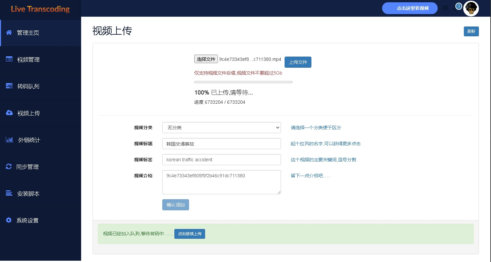

# CTS

2018年开发的,一套单机视频转码系统          
看看是不是还能用到什么吧
            
<h1>
 
这个版本不会在更新了,写了个新的v2完成了还没推 
不要公网商用, 这个当时是部署在内网的,所以没做安全处理     

</h1>
        
### 安装

>部署文档见 [Deploy_Doc.md](./Deploy_Doc.md)

### 预览

后台          

后台首页        

上传页

管理页

队列

前台

前台列表        

视频播放

### 功能

使用方式

1. 登录 =》 选择视频文件 =》 上传
   等待上传成功，上传成功会返回标题等信息

   1. 修改标题，设置标签，发布视频
      后台自动转码开始

   2. 点击 “视频管理”可以看到视频信息
      点击 表格里的“Share”图标 获得M3U8外链

   3. 转码队列可以看到转码的进度

其他功能陆续添加，例如统计，同步等功能.......

转码输出
(本系统转码后输出的文件和格式介绍)

    MP4文件
    http://192.168.1.200/cloud/20180327/hVHnIbkMVq/hVHnIbkMVq.mp4

	M3U8文件
	http://192.168.1.200/cloud/20180327/hVHnIbkMVq/index.m3u8

	缩略图 10张
	http://192.168.1.200/cloud/20180327/hVHnIbkMVq/img/1.jpg
	http://192.168.1.200/cloud/20180327/hVHnIbkMVq/img/2.jpg
	http://192.168.1.200/cloud/20180327/hVHnIbkMVq/img/3.jpg
	http://192.168.1.200/cloud/20180327/hVHnIbkMVq/img/4.jpg
	.......
	http://192.168.1.200/cloud/20180327/hVHnIbkMVq/img/10.jpg

	九宫格 3x3
	http://192.168.1.200/cloud/20180327/hVHnIbkMVq/mozaique.jpg

	Sider 20x1
	http://192.168.1.200/cloud/20180327/hVHnIbkMVq/slide.jpg

	GIF动态
	http://192.168.1.200/cloud/20180327/hVHnIbkMVq/perview.gif

### 已知问题

    部分老视频因为非标准模式，加水印会出现水印位置偏移导致报错
    所以暂时不要开启水印， 水印是Logo图片， 不是滚动字幕广告，这个没影响

### 广告字幕写死了  位置在app下面 app/adsubtitle.ass
    直接修改这个文件即可

